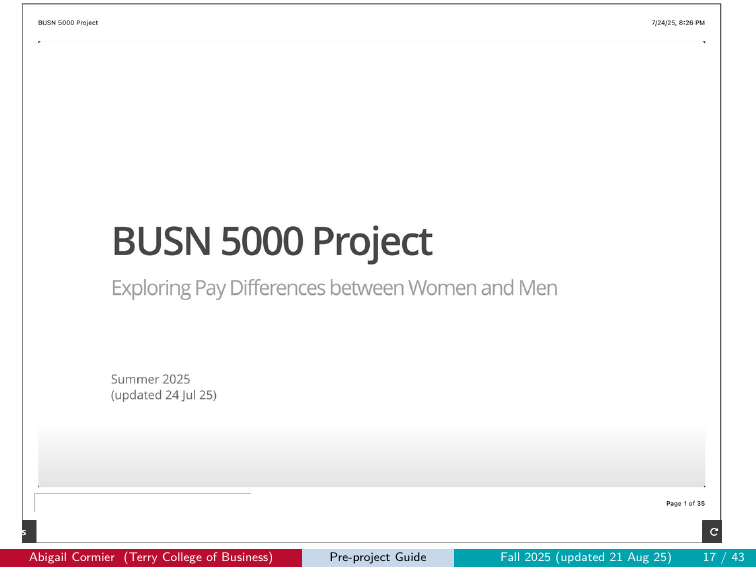
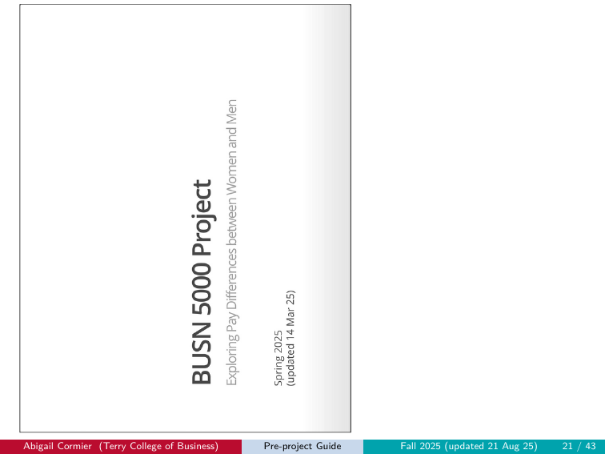
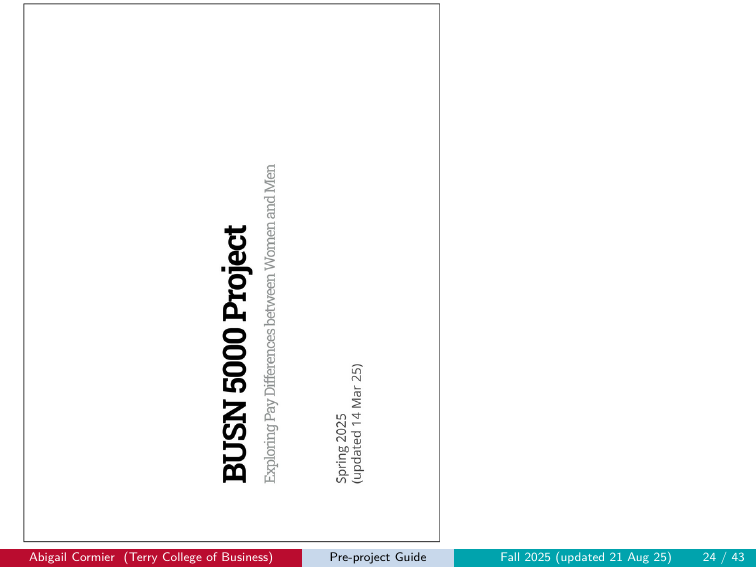
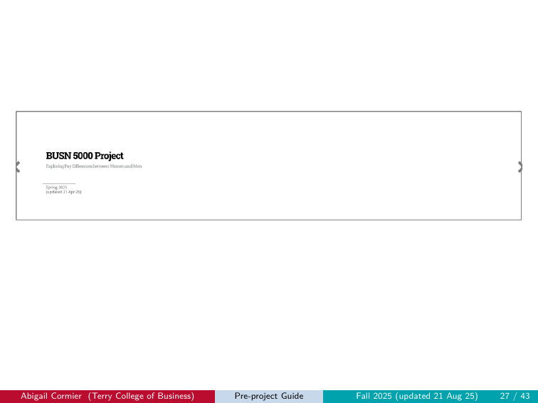
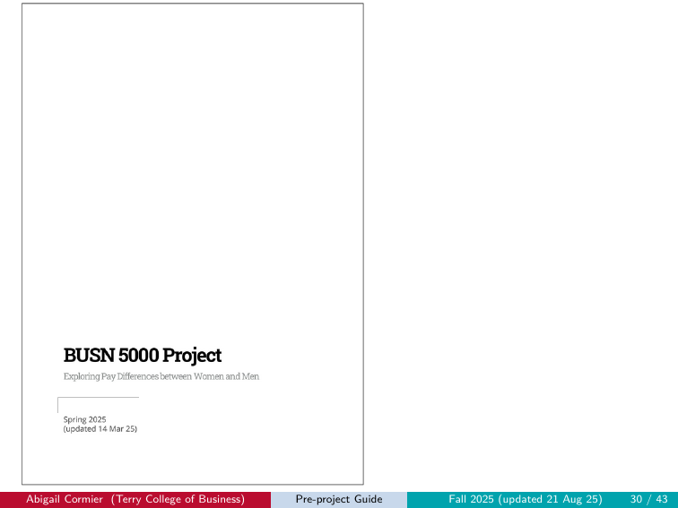
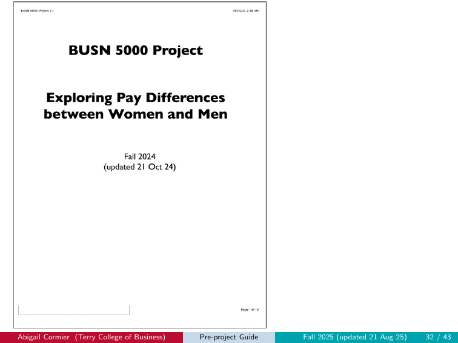
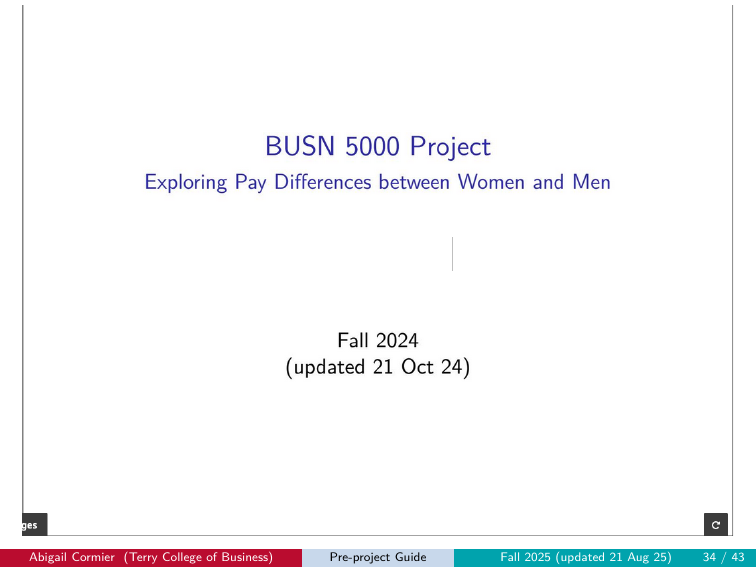
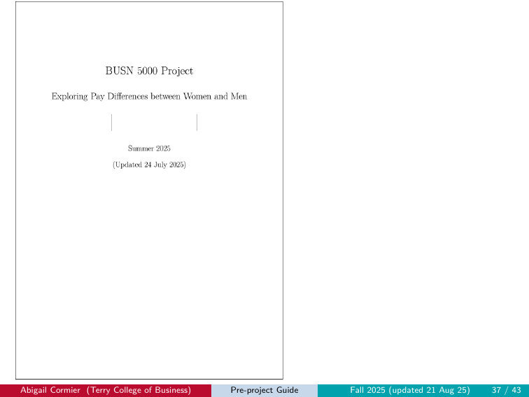
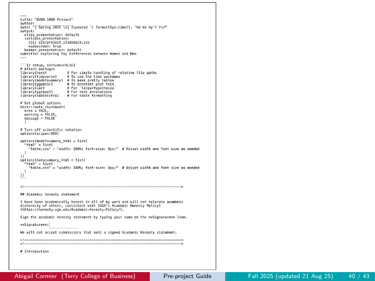
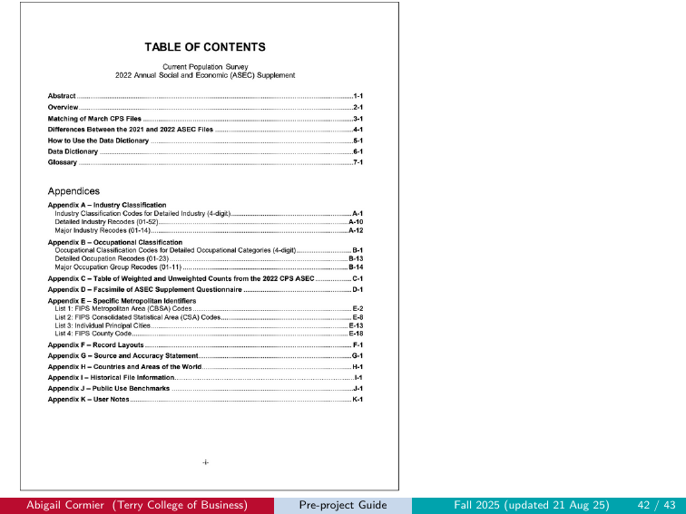

# Common Errors

If something has gone wrong, look here first. This chapter is a
diagnostic catalog of the failure modes we see most often, organized
roughly in the order they tend to bite during the project workflow.

## How to use this chapter

- **If you've gotten an error message** when running a script or
  knitting, search the relevant section below for the symptom.
- **If your output renders but looks wrong** when you compare it to
  the reference in the [Submission chapter](submission.qmd), jump
  to [Output format errors](#output-format-errors) — that's where
  the visual examples live.
- **If you've checked everything and still can't resolve it,** see
  [Getting help](#getting-help) at the end of this chapter.

Each entry follows the same pattern: **Symptom**, **Cause**, **Fix**.

## Setup errors

### CSS not loading

**Symptom:** Your knitted slides have no UGA styling — plain text,
no colors, default fonts.

**Cause:** Either (a) `project_slidedeck.css` is anywhere other
than `Project/css/`, or (b) the `.Rmd` file you're knitting isn't
in your `Project/` root (e.g., you left it in your Downloads
folder), so the relative path `css/project_slidedeck.css` in the
Rmd's YAML can't find the CSS.

**Fix:** Confirm both files are in the right places: the CSS in
`Project/css/` AND the `.Rmd` in your `Project/` root. Open RStudio
by double-clicking `Project.Rproj`, then re-knit. Visual example of
what the bad output looks like:
[Wrong CSS](#output-format-errors).

### Working from your Downloads folder

**Symptom:** "File not found" errors when running scripts or
knitting. R can't see your data files even though they exist.

**Cause:** RStudio's working directory is your Downloads folder,
not your `Project/` folder. The `here()` paths in scripts and the
Rmd resolve to the wrong place.

**Fix:** Move all files into `Project/` and always open RStudio by
double-clicking `Project.Rproj`. Never work from Downloads.

### Required files missing or in the wrong subfolder

**Symptom:** "Cannot open the connection" or "object not found"
errors during a script run or knit.

**Cause:** A required file isn't where the script or Rmd expects
it (e.g., `LF.R` is in your project root instead of `r/`, or
`pppub24.csv` is missing from `data/`).

**Fix:** Run `check_setup_preproject.R` (pre-project) or
`check_setup_project.R` (main project). The script tells you
exactly which file is misplaced and where it should go.

## Workflow errors

### Knitting before running the R script

**Symptom:** Knit errors out with a "file not found" message
pointing at `out/LF.csv` or `data/cpsmar_e.csv`.

**Cause:** You haven't run `LF.R` (pre-project) or `cpsmar_e.R`
(main project) yet, so the file the Rmd is trying to read doesn't
exist.

**Fix:** Run the relevant R script first (open it in the editor,
Select All, click Run), then knit the Rmd.

### Variable name confusion

**Symptom:** Knit errors out mid-document with "object not found"
— a chunk references `cpsmar_a` but you defined `cpsmar_e` (or
similar).

**Cause:** Typo or misalignment between chunks. You defined the
analysis sample with one name, then referenced a different name in
a downstream chunk.

**Fix:** Read each chunk carefully. Match data-frame names exactly
across chunks. The variable structure in the template is:
`cpsmar_e` (the extract) → `cpsmar_a` (the analysis sample) →
`singles` (the singles subset).

### Touching the setup chunk

**Symptom:** Output looks broken or knit fails in unexpected ways
(missing libraries, scientific notation issues, formatting wrong).

**Cause:** You changed `include = FALSE` to `include = TRUE` on
the setup chunk, or otherwise modified the setup chunk's contents.

**Fix:** Restore the setup chunk to its original state. The
`eval = FALSE → TRUE` toggle only applies to content code chunks
(`btl1`, `btl2`, `mi1`, etc.), never the setup chunk.

## Rendering errors (the knit step)

### Leaving `eval = FALSE` on a completed chunk

**Symptom:** Your code is correct but the output doesn't appear in
the knitted slide. The chunk shows the code but no result below it.

**Cause:** The chunk option `eval = FALSE` is still set. R Markdown
displays the code but skips running it during knit.

**Fix:** Change `eval = FALSE` to `eval = TRUE` on every content
chunk you've completed. Re-knit.

### Editing the YAML beyond the author line

**Symptom:** The knit produces unexpected output — different
layout, missing CSS, wrong document class, no slide breaks.

**Cause:** You changed something in the YAML besides the `author:`
line (e.g., the `output:` value, the `css:` reference, the
`widescreen:` setting).

**Fix:**

1. Download a fresh copy of the relevant Rmd
   (`pre_project.Rmd` or `project.Rmd`) from the file pack on
   eLC. Save it somewhere temporary like your Downloads folder —
   not in your `Project/` directory.
2. Open the fresh copy. Copy the entire YAML block (the section
   between the two `---` markers at the top of the file).
3. Open your working Rmd. Replace your current YAML with the YAML
   you just copied.
4. Re-add your name on the `author:` line.
5. **Delete the fresh Rmd copy** from your Downloads folder so you
   don't accidentally start working in it instead of your real
   file.
6. Re-knit.

### Using the Knit dropdown instead of the Knit button

**Symptom:** Output is a Word document, a LaTeX-styled PDF, or some
format that doesn't match the slide deck reference.

**Cause:** You clicked the small dropdown arrow next to the Knit
button and selected "Knit to PDF / Word / etc." That overrides the
output format specified in the Rmd's YAML.

**Fix:** Click the **Knit** button itself, not the dropdown arrow.
The YAML already tells R Markdown to knit to HTML; just trust the
button.

## Output format errors

These are the canonical "submission rejected" failure modes, each
shown with a real example from a prior submission. If your output
matches any of these images, your submission will receive a 0.

### Wrong CSS

**Symptom:** Output is in landscape but has no UGA styling — plain
text, gray gradients, default browser fonts.

**Cause:** `project_slidedeck.css` was not found at knit time
(usually because it's not in `Project/css/`).

**Fix:** Verify the CSS file is in `Project/css/`. Verify the Rmd
you are working on is in `Project/`, not somewhere else (like
`Downloads/`). Re-knit.

{fig-alt="Slide with plain text, no UGA styling, default fonts and gray gradients"}

### Wrong CSS + wrong orientation

**Symptom:** Output is portrait AND has no UGA styling.

**Cause:** Both CSS is missing and the print dialog saved as
portrait.

**Fix:** Move CSS to `Project/css/`. Verify the Rmd you are working
on is in `Project/`, not somewhere else (like `Downloads/`).
Re-knit, then save with **Landscape** orientation.

{fig-alt="Portrait-oriented slide deck with no UGA styling"}

### Wrong orientation

**Symptom:** Correct UGA styling, but the PDF is portrait.

**Cause:** Print dialog defaulted to portrait and you didn't change
it.

**Fix:** In the browser's print dialog, set **Layout / Orientation
to Landscape** before saving.

{fig-alt="Portrait-oriented slide deck with correct UGA styling"}

### Long landscape

**Symptom:** Landscape PDF, but the slide content is stretched
horizontally across a single very wide page instead of broken into
separate slide pages.

**Cause:** A print dialog scaling setting fit multiple slides onto
one wide page.

**Fix:** Reset print dialog scaling to default. Make sure
**Pages per sheet = 1**.

{fig-alt="Single wide page with multiple slides squished onto it"}

### Portrait

**Symptom:** Output is portrait. (Same as "Wrong orientation"
above, isolated here as an example.)

**Cause:** Print dialog defaulted to portrait.

**Fix:** Set Layout to **Landscape**.

{fig-alt="Portrait-oriented slide deck"}

### Portrait + wrong CSS

**Symptom:** Output is portrait AND has no UGA styling. Same
underlying causes as the "Wrong CSS + wrong orientation" case,
isolated here as a distinct example pattern.

**Fix:** Move CSS to `Project/css/`. Verify the Rmd you are working
on is in `Project/`, not somewhere else (like `Downloads/`).
Re-knit, then save with **Landscape** orientation.

{fig-alt="Portrait-oriented slide deck with no UGA styling"}

### LaTeX slides (knit-to-PDF, slide format)

**Symptom:** Output is a slide deck rendered with LaTeX/Beamer
styling — different fonts, different layout, no UGA brand colors.

**Cause:** You used the Knit dropdown to select "Knit to PDF" with
slide output, overriding the Rmd's HTML-based ioslides format.

**Fix:** Use the Knit button (not the dropdown). The Rmd's YAML
specifies `ioslides_presentation` for a reason. If your YAML has
also been modified (which often goes hand-in-hand with this
error), restore it by following the 6-step process under
[Editing the YAML beyond the author line](#editing-the-yaml-beyond-the-author-line).
Then re-knit.

{fig-alt="Slide deck rendered as LaTeX/Beamer instead of HTML ioslides"}

### LaTeX document (knit-to-PDF, document format)

**Symptom:** Output is a regular PDF document, not a slide deck at
all. Looks like a paper or article.

**Cause:** You used the Knit dropdown to select "Knit to PDF" with
document output, AND likely modified the YAML to change the output
format.

**Fix:** Restore the YAML. Knit with the button. Save as PDF from
the HTML output.

{fig-alt="Regular PDF document instead of a slide deck"}

### Not knit

**Symptom:** Submission is the raw `.Rmd` file, or a file that was
never actually knit — no rendering at all.

**Cause:** You uploaded the wrong file (the `.Rmd` source instead
of the saved-as-PDF output).

**Fix:** Knit the Rmd to HTML, save the HTML as PDF using your
browser's print dialog, then upload that PDF.

{fig-alt="Raw Rmd content or unrenderable file submitted"}

### Wrong file

**Symptom:** Submission is something other than the intended
project artifact — an old version, a template, an unrelated
document.

**Cause:** You uploaded the wrong file.

**Fix:** Locate the correct PDF in your `Project/` folder and
re-upload. Double-check the filename matches the convention.

{fig-alt="Wrong file submitted to Gradescope"}

## Content errors

### Numbers in your paragraph don't match `LF.csv` (pre-project)

**Symptom:** Your slide 3 paragraph cites numbers that don't
reflect your own data — they came from a classmate or from a
previous semester.

**Cause:** You copied numbers from a peer instead of running
`LF.R` yourself, or `LF.R` didn't actually run and the values you
wrote down were stale.

**Fix:** Run `LF.R` yourself. Open `out/LF.csv` (or print `lf` in
the console). Fill in your slide 3 paragraph with those values,
rounded to two decimal places.

### Wrong filename

**Symptom:** Your file was uploaded but appears under an unexpected
name in Gradescope, or you can't tell which submission is which in
your `Project/` folder later.

**Cause:** The filename didn't match the required pattern.

**Fix:** Rename your file to the correct convention
(`firstname_lastname_pre.pdf` /
`firstname_lastname_progress.pdf` /
`firstname_lastname_project.pdf`) and re-upload.

## Getting help {#getting-help}

If your error isn't in this chapter, or you've checked and still
can't resolve it, here's how to ask for help.

::: {.callout-important}
## Communication policy (summarized from the syllabus)

- **For content-related questions**, contact **TAL staff** first.
  If TAL staff can't solve the problem, then email Abbi or
  Dr. Cornwell.
- **For administrative questions**, email **Abbi first**. She'll
  loop in Dr. Cornwell if needed.
- **One thread per issue.** Don't send the same problem to both
  Abbi and Dr. Cornwell on separate emails. We will loop the other
  in if needed. Duplicate emails waste resources for your
  classmates.
- **No content review by email before the deadline.** We will not
  pre-grade or review your project ahead of the due date.
- **Email format requirements:**
  - **Subject line:** include your section time and a brief
    category (e.g., "coding error" or "homework question").
  - **Greeting:** "Hey" is not a proper greeting. "Dear Abbi" or
    "Dear Ms. Cormier" is.
  - **Body:** a clear description of the problem and what you've
    tried. For coding issues, paste your code in the email body.
    For project errors, attach your `.Rmd` file and paste the
    error message in the body. **Do not send screenshots or
    photos.**
  - **Closing:** a proper closing (e.g., "Respectfully,
    your_name").

Omission of any of these features may cause your message to be
rejected.
:::

The full communication policy lives in the course syllabus on
eLC — see the **Communication** section. If your question is
about email mechanics rather than course content, check there
first.
