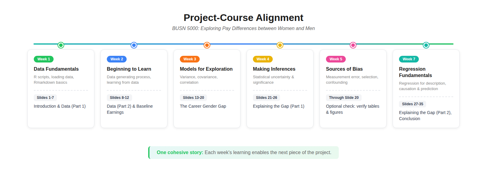

# Main Project

The Main Project — **Exploring Pay Differences between Women and
Men** — is the central artifact of BUSN 5000. You'll use R and
R Markdown to conduct an empirical analysis of the gender wage gap
using the March 2024 CPS, then "knit" the code and your write-ups
together into a 35-slide PDF deck.

The Project counts for **20% of your course grade** (per the
syllabus).

This chapter walks through the project one slide at a time. Each
slide has either a coding task, a write-up task, or both — and a
point allocation. Treat it as a checklist you can work through in
order.

## Project-course alignment

The project is intentionally built to mirror the course content
week by week. As you cover new material in class, the next chunk
of the project becomes doable.

{fig-alt="Diagram showing how the 35 project slides map to weeks 1-7 of the in-person course: Week 1 Data Fundamentals → Slides 1-7; Week 2 Beginning to Learn → Slides 8-12; Week 3 Models for Exploration → Slides 13-20; Week 4 Making Inferences → Slides 21-26; Week 5 Sources of Bias → Through Slide 20 (optional check); Week 7 Regression Fundamentals → Slides 27-35"}

::: {.callout-note}
## BUSN 5000E summer schedule

The image above shows the in-person (16-week) Spring/Fall pacing.
The BUSN 5000E summer schedule is condensed — two course modules
per calendar week. Re-mapped to BUSN 5000E calendar weeks:

- **Week 1** (Modules 1–2, Data Fundamentals + Beginning to
  Learn): unlocks project slides 1–12
- **Week 2** (Modules 3–4, Models for Exploration + Making
  Inferences): unlocks slides 13–20
- **Week 3** (Modules 5–6, Measurement Error & Confounding):
  optional check on tables & figures through slide 20
- **Week 4** (Modules 7–8, Bayesian + Regression Fundamentals):
  unlocks slides 21–35; **Project Progress Check due Mon Jul 6**
- **Week 7**: **Final Project due Thu Jul 23**
:::

If you fall behind on the course content, the project gets harder
fast. Stay on schedule.

## Before you start

This chapter assumes you've completed [Setup](setup.qmd) and the
[Pre-project](pre-project.qmd) and that your `Project/` directory
already contains the pre-project assets (CSS file, `LF.R`, raw
CSVs in `data/`, etc.). The Main Project pack adds a few more
files to that same directory:

- `project.Rmd` — the working file you'll edit and knit
- `cpsmar_e.R` — the R script that creates the project's data
  extract from the raw CPS files
- `cpsmar24_documentation.pdf` — the CPS codebook (variable
  definitions, value codes)
<!--
  TODO: `Project_Progress_Check_Tables_and_Figures.pdf` was
  intentionally removed from this list. It is being gated so
  students only see it between the progress check deadline and the
  final project due date. The hosting/gating mechanism is still
  TBD — see notes.Rmd Wave 2 File packs.
-->
- `project_progress_check_template.html` — a partial knit showing
  the project's initial tables and figures
- `check_setup_project.R` — verifies your file sort for the main
  project

Sort those into your existing `Project/` directory following the
same conventions as the pre-project (Rmd in root, R scripts in
`r/`, PDFs in root, etc.). Then run `check_setup_project.R` from
RStudio (open the script, Select All, Run) to confirm everything's
in place.

## General rules

Before you write a single line of code, internalize these:

### Slide format

A properly constructed slide deck has **35 slides on 35 pages of
PDF output**, rendered in landscape mode, with every detail of the
formatting matching the
[Final Project reference](submission.qmd#final-project-reference-what-your-35-slides-should-look-like)
in the Submission chapter.

If your deck doesn't comply exactly, it will receive a 0%.

### Write-up line limits

Each write-up slide has a specific line limit (noted in the
slide's section below). **We will not read beyond the line limit.**
Stay disciplined — concise writing is what's being graded, not
volume.

::: {.callout-important}
## What counts as a "line"

"Lines of text" means **rendered, countable lines on your final
PDF** — not sentences, and not lines as they appear in RStudio's
editor or output preview. A long sentence that wraps into three
visual lines on the rendered slide counts as three lines.

Submissions that exceed the line limit are **heavily penalized**.
Always check your knitted PDF and count the actual visible lines
on the slide before you submit.
:::

### Echo settings

The template's global `echo = TRUE` setting displays your code on
each slide by default. We've individually overridden this to
`echo = FALSE` on a specific list of chunks where displaying the
code would be redundant or take up unnecessary space:

- The `.5` chunks (`btl2.5`, `mi2.5`, `mi3.5`, `reg1.5`, `reg2.5`)
  — these display tables and figures from objects defined in the
  previous chunk; the "code" is just the object name.
- The three `datasummary` chunks (`mi1`, `ed_vars`, `demo_vars`)
  — `datasummary` calls are long and not informative to show.
- The appendix `var_doc_table` chunk — just renders the
  documentation table built in `var_doc`.

**Do not edit these `echo` settings.** They exist to keep the deck
to exactly 35 slides.

### HTML commands wrapping chunks

Some chunks are wrapped in `<div class="table-...">` and `</div>`
tags. These are required for table formatting. **Do not edit or
remove them.**

### The YAML block

When you open `project.Rmd` for the first time, fill in your name
on the `author:` line of the YAML — that's the only change you
should make to the YAML. After your name is in, save the file
under a new name following the convention from the
[Submission chapter](submission.qmd#filename-conventions):
`firstname_lastname_project.Rmd`.

The canonical project YAML block (for reference and recovery if
yours gets corrupted):

```yaml
---
title: "BUSN 5000 Project"
subtitle: "Exploring Pay Differences between Women and Men"
author: "First Name Last Name"
date: |
    | Summer 2026
    | (updated `r format(Sys.time(), '%d %b %y')`)
output:
  ioslides_presentation:
    css: css/project_slidedeck.css
    widescreen: true
---
```

::: {.callout-important}
**Do not change anything else in the YAML.** Edits beyond the
`author:` line break the rendering — see
[Common Errors §6.4.2](common-errors.qmd#editing-the-yaml-beyond-the-author-line)
for the fix when this happens.
:::

### The setup chunk

The setup chunk loads the required packages and sets global
options. **Do not change anything in the setup chunk.**

The default `echo = TRUE` is intentional. The `eval` toggle on
each chunk is where you flip a chunk from "not run" to "run" once
you've completed it — and that toggle applies only to content
chunks (`btl1`, `btl2`, `mi1`, etc.), never the setup chunk. See
[Common Errors §6.3.3](common-errors.qmd#touching-the-setup-chunk)
if you've accidentally touched it.

::: {.callout-tip}
## Workflow tip

Work the project code chunks in stages. After you complete a
chunk and confirm it runs cleanly (click the green play button at
the top-right of the chunk), set `eval = TRUE` on that chunk so
its output appears when you knit. You can run individual chunks
without knitting the entire document.
:::

## A note on units

Throughout your write-ups, use **percent** and **percentage point**
correctly. They are not interchangeable.

A wage gap going from 25% to 20% is a **5 percentage point**
decrease — not a 5% decrease. (A 5% decrease from 25% would be
23.75%, not 20%.) Mixing the two is a recurring point of deduction.

## Slide-by-slide instructions

The point allocation for each graded slide is shown in parentheses
next to the slide title. Slides without a point allocation are
section dividers or scaffolding chunks (the code chunks whose
output is displayed on the next `.5` slide).

### Front matter (slides 1–2)

#### Slide 1: BUSN 5000 Project

Title slide. It's auto-formatted with your name from the YAML
`author:` line.

#### Slide 2: Academic Honesty Statement *(1 point)*

Indicate your compliance by typing your first and last name on the
"Signature:" line. You may consult Terry Analytics Lab staff, the
TA, or the instructor for help — but you may not seek assistance
or otherwise collaborate with anyone else.

### Introduction (slides 3–4)

#### Slide 3: Introduction

Section divider.

#### Slide 4: Overview *(2 points)*

Provide a brief overview of the project. Include:

- What you are trying to learn about
- The data you are using to learn
- A brief summary of your findings

Limit your overview to **6 lines of text**.

::: {.callout-tip}
## Pro tip

To quote Yoda: "Do or do not. There is no try." When you explain
what your project is about or summarize what you learned, don't
say "I try / seek / look / aim / attempt (or am trying / seeking
/ ...)". Instead, say "I show / document / demonstrate / report /
find ...". Never say "I hope..."

You might write this slide *last*. It's easier to summarize your
findings after you've completed the analysis.
:::

### Data (slides 5–8)

#### Slide 5: Data

Section divider.

#### Slide 6: March 2024 CPS *(4 points)*

Using the ASEC documentation
(`cpsmar24_documentation.pdf`), provide a brief overview of the
March 2024 CPS. Include:

- Approximately the number of households surveyed
- A description of the standard monthly CPS
- The additional information collected in the ASEC

Limit your summary to **4 lines of text**.

::: {.callout-tip}
## Pro tip

Do not copy and paste from the CPS documentation. Write it in
your own words.
:::

#### Slide 7: March 2024 CPS Extract *(4 points)*

Complete the `read_data` code chunk to read the extract you
created with `cpsmar_e.R`.

Then, in the write-up section, explain the actions you applied to
the March 2024 survey in `cpsmar_e.R` to create the data extract
`cpsmar_e.csv`. Include:

- The variables you selected from the person file
- The variables you selected from the household file
- The restriction(s) you applied to the data extract
- The number of observations and variables in the data extract

Limit your explanation to **6 lines of text**.

::: {.callout-tip}
## Pro tips

Refer to each variable by its plain English meaning, not the
name used in the script. Refer to the key tidyverse "verbs" in
the script, like `mutate` and `rename`.
:::

#### Slide 8: Analysis sample *(2 points)*

Complete the `btl1` code chunk to create your analysis sample
(`cpsmar_a`) with the following restrictions and additions:

- Restrict to individuals who are 23 to 62 years old (inclusive)
- Restrict to individuals who have positive earnings
- Create a character-valued `gender` variable

Underneath the code chunk, document the number of observations in
your analysis sample.

Limit your documentation to **2 lines**.

::: {.callout-tip}
## Pro tips

Refer to your notes for examples of `filter` and `mutate`.
Consult the Environment tab in the Northeast pane of RStudio for
information about the `cpsmar_a` data frame.
:::

### Baseline earnings distributions (slides 9–12)

#### Slide 9: Baseline earnings distributions

Section divider.

#### Slide 10: Plotting earnings distributions

Complete the `btl2` code chunk to:

- Create the `figure1` ggplot object (the earnings distribution
  by gender plot)
- Calculate average earnings for each gender using the
  `earnings_fvm` object
- Pull the average earnings for women and men into single values
  (`avg_earnings_f`, `avg_earnings_m`) using `filter` and `pull`

#### Slide 11: Distribution of earnings by gender *(8 points)*

Complete the `btl2.5` code chunk to display Figure 1 by writing
the name of the Figure 1 object.

#### Slide 12: Baseline comparisons *(4 points)*

Summarize the main empirical facts associated with Figure 1.
Include:

- A description of the most important fact communicated by the
  figure
- The average earnings of men and women
- The dollar difference and percentage difference in average
  earnings between men and women in the sample

Limit your summary to **5 lines of text** on the slide.

::: {.callout-tip}
## Pro tips

Use inline R syntax with the `avg_earnings_f` and `avg_earnings_m`
objects to insert the respective averages in your write-up
(rather than typing the numbers manually).
:::

### The career gender gap (slides 13–20)

#### Slide 13: The career gender gap

Section divider.

#### Slide 14: Wages and hours differences *(8 points)*

Complete the `mi1` code chunk to create and display Table 1
(wages and hours by gender).

#### Slide 15: Documenting the differences *(2 points)*

Summarize the wage and hours differences presented in Table 1.

Limit your documentation to **3 lines of text** on the slide.

#### Slide 16: Plotting career log wage profiles

Complete the `mi2` code chunk to estimate log wage profiles for
women and men and create Figure 2.

#### Slide 17: Career log wage profiles *(8 points)*

Complete the `mi2.5` chunk to display Figure 2.

#### Slide 18: Estimating wage differences over a career

Complete the `mi3` code chunk to create Table 2. This involves:

- Creating `males` and `females` objects using `filter` and
  `rename`
- Merging the two into the `diff_fvm` object using `inner_join`
- Calculating the difference between average log wages using
  `mutate`
- Grouping by `age_group`
- Using `kable()` to organize the results into the `table2`
  object

#### Slide 19: Evolution of the gender wage gap *(8 points)*

Complete the `mi3.5` code chunk to display Table 2.

#### Slide 20: Discussing the gender wage gap evolution *(2 points)*

Summarize the results presented in Figure 2 and Table 2.

Limit your summary to **3 lines of text** on the slide.

### Explaining the gender wage gap (slides 21–30)

#### Slide 21: Explaining the gender wage gap

Section divider.

#### Slide 22: Fitting the log wage profiles

Complete the `reg1` code chunk to create Figure 3 by fitting the
career profiles with a quadratic in age.

#### Slide 23: Log wage profiles with quadratic fits *(8 points)*

Complete the `reg1.5` chunk to display Figure 3.

#### Slide 24: Gender differences in education *(8 points)*

Complete the `ed_vars` code chunk to create and display Table 3
(educational attainment by gender).

#### Slide 25: Gender differences in demographics *(8 points)*

Complete the `demo_vars` code chunk to create and display Table 4
(demographic characteristics by gender).

#### Slide 26: Documenting differences in characteristics *(4 points)*

- Summarize the educational attainment differences presented in
  Table 3
- Summarize the differences in demographic characteristics
  presented in Table 4

Limit your documentation to **6 lines of text** on the slide.

#### Slide 27: Controlling for education and demographic characteristics

Complete the `reg2a` code chunk to create:

- The `singles` subset of the analysis data
- The `models` object containing five regression models that
  incrementally add controls for education and demographic
  characteristics, with the fifth restricting to unmarried
  workers without children under 6 ("Only Singles")

In the regression analysis, you'll distinguish between personal
and household characteristics among the demographic variables.

::: {.callout-tip}
## Pro tips

- Moving from top to bottom in the `models` object, the list of
  controls grows as indicated by the name of the model — with the
  exception of the final model "Only Singles", which estimates
  the same relationship as the "Add Person" model but on the new
  subset.
- To decide whether a variable belongs in the "Add Person" or
  "Add Household" model, ask yourself: *"Can I define this
  variable for a particular individual irrespective of other
  individuals who may or may not exist in their life?"* If yes →
  Person. If no (it depends on someone else, like a spouse or a
  child) → Household.
:::

#### Slide 28: Reporting the results

Complete the `reg2b` code chunk to create Table 5. This involves:

- Constructing the coefficient map object to display only the
  gender and age coefficient estimates
- Constructing the goodness-of-fit object to display sample size
  and $R^2$ values
- Constructing a `rows` object to distinguish the regression
  specification associated with each column

::: {.callout-tip}
## Pro tip

Make sure you report robust standard errors and indicate that you
do in a table note.
:::

#### Slide 29: Explaining the gender wage gap *(8 points)*

Complete the `reg2.5` chunk to display Table 5.

#### Slide 30: Documenting the findings *(4 points)*

Summarize how the estimated average gender wage gap changes as
you add education, personal, and household characteristics to the
regression — and then how it changes when the sample is restricted
to singles.

Limit your documentation to **6 lines of text** on the slide.

::: {.callout-tip}
## Pro tips

Start your write-up with the baseline model and describe
subsequent results relative to the baseline. Focus on the Female
coefficient estimate and its standard error. Remember how the
coefficient estimate is correctly interpreted.
:::

### Conclusion (slides 31–32)

#### Slide 31: Conclusion

Section divider.

#### Slide 32: Summary *(4 points)*

Briefly summarize the objective of the project and its main
findings. Note:

- The sample on which your analysis is based
- The overall gender wage gap
- How it evolves over a career
- How it varies when controlling for education and demographic
  characteristics

Limit your documentation to **7 lines of text** on the slide.

### Appendix (slides 33–35)

#### Slide 33: Appendix

Section divider.

#### Slide 34: Data documentation

Complete the `var_doc` code chunk to create a table of the main
variables used in this project with their definitions.

#### Slide 35: List of main variables with definitions *(4 points)*

Once you complete the `var_doc` chunk on the previous slide, set
`eval = TRUE` on this slide to render the table of main variables
with their definitions.

## Submission

See the [Submission chapter](submission.qmd) for:

- Filename convention (`firstname_lastname_project.pdf`)
- The HTML → PDF workflow
- Browser-specific save-as-PDF settings
- The 35-slide visual reference

## Common pitfalls

The recurring failure modes for the Main Project are catalogued in
[Common Errors](common-errors.qmd). The ones most specific to the
Main Project (vs. the Pre-project) are:

- **Variable name confusion** — defining `cpsmar_a` but referencing
  `cpsmar_e` (or vice versa) in a later chunk. See
  [Common Errors §6.3.2](common-errors.qmd#variable-name-confusion).
- **Forgetting to run `cpsmar_e.R` before knitting.** See
  [Common Errors §6.3.1](common-errors.qmd#knitting-before-running-the-r-script).
- **Touching the setup chunk's `include = FALSE`** — same
  scaffolding error as the pre-project. See
  [Common Errors §6.3.3](common-errors.qmd#touching-the-setup-chunk).
- **Editing the YAML beyond the author line.** See
  [Common Errors §6.4.2](common-errors.qmd#editing-the-yaml-beyond-the-author-line).

When in doubt, see [Common Errors](common-errors.qmd) — most issues
have already been documented.

## What happens next

- For the optional Project Progress Check at Week 4, see
  [Chapter 5: Progress Check](progress-check.qmd).
- When the Final Project deadline arrives, see
  [Chapter 6: Submission](submission.qmd) for the save-as-PDF
  walkthrough and the filename convention.
